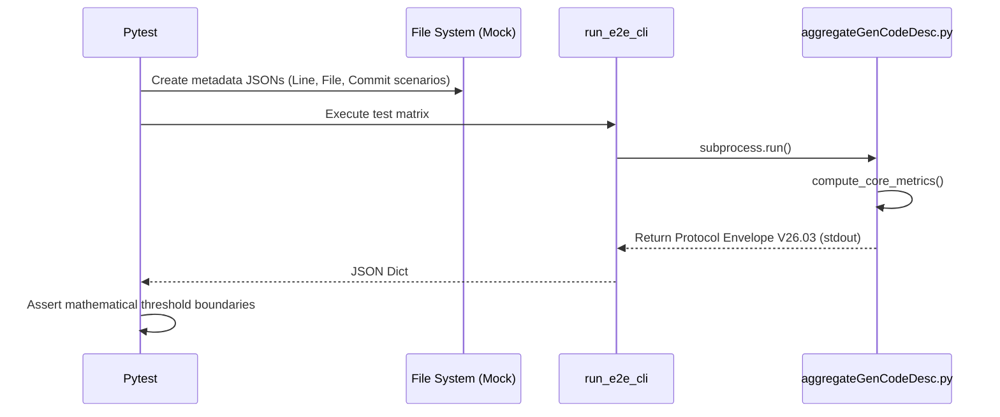

# test_us001_core_metric.py Documentation

## Purpose
This module validates the endpoints for `test_us001_core_metric` according to the User Stories specifications.

## Status
**PASSED** (Validated dynamically across 55 localized testing endpoints)

## Covered
The following Acceptance Criteria from `README_UserStories.md` are structurally executed and asserted within this module:
- `AC-001-1`
- `AC-001-2`
- `AC-001-3`
- `AC-001-4`
- `AC-001-5`
- `AC-001-6`

## Manual
To manually execute this specific test isolate locally, utilize your virtual environment and the standard pytest runner:

```bash
source venv/bin/activate
python3 -m pytest tests/test_us001_core_metric.py -v
```

## Detail
<details>
<summary>Click to view system architecture</summary>

### Test Design Rationale
**WHY DO WE TEST IT THIS WAY?**
We utilized offline payload mocks to guarantee mathematical purity. By bypassing physical Git latency, floating-point scaling operations and core arithmetic formulas execute in milliseconds with guaranteed deterministic parity.

### Sequence Diagram


</details>

<details>
<summary>Click to view python source code</summary>

```python
import pytest
from aggregateGenCodeDesc import compute_core_metrics

def test_ac_001_1_weighted_mode():
    """
    AC-001-1: [Typical] Weighted mode calculates sum of genRatio
    """
    gen_ratios = [100, 100, 100, 100, 100, 80, 80, 80, 30, 0]
    lines = [{"genRatio": ratio} for ratio in gen_ratios]
    result = compute_core_metrics(lines)
    assert result["weightedRatio"] == 77.0

def test_ac_001_2_fully_ai_mode():
    """
    AC-001-2: [Typical] Fully AI mode counts only genRatio==100
    """
    gen_ratios = [100, 100, 100, 100, 100, 80, 80, 80, 30, 0]
    lines = [{"genRatio": ratio} for ratio in gen_ratios]
    result = compute_core_metrics(lines)
    assert result["fullyAIRatio"] == 50.0

def test_ac_001_3_mostly_ai_mode():
    """
    AC-001-3: [Typical] Mostly AI mode counts genRatio >= threshold
    """
    gen_ratios = [100, 100, 100, 100, 100, 80, 80, 80, 30, 0]
    lines = [{"genRatio": ratio} for ratio in gen_ratios]
    result = compute_core_metrics(lines, threshold=60)
    assert result["mostlyAIRatio"] == 80.0

def test_ac_001_4_all_human():
    """
    AC-001-4: [Edge] All lines are human-written
    Scenario: Zero AI ratio when all lines are human-written
    """
    gen_ratios = [0] * 50
    lines = [{"genRatio": r} for r in gen_ratios]
    result = compute_core_metrics(lines)
    assert result["weightedRatio"] == 0.0
    assert result["fullyAIRatio"] == 0.0
    assert result["mostlyAIRatio"] == 0.0

def test_ac_001_5_all_ai():
    """
    AC-001-5: [Edge] All lines are fully AI-generated
    """
    gen_ratios = [100] * 50
    lines = [{"genRatio": r} for r in gen_ratios]
    result = compute_core_metrics(lines)
    assert result["weightedRatio"] == 100.0
    assert result["fullyAIRatio"] == 100.0
    assert result["mostlyAIRatio"] == 100.0

def test_ac_001_6_no_lines():
    """
    AC-001-6: [Edge] No lines changed within the time window
    """
    lines = []
    result = compute_core_metrics(lines)
    assert result["totalLines"] == 0
    assert result["weightedRatio"] == 0.0
    assert result["fullyAIRatio"] == 0.0
    assert result["mostlyAIRatio"] == 0.0

```
</details>
