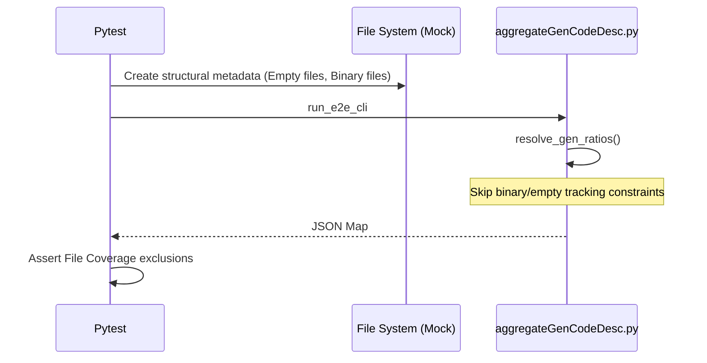

# test_us002_file_conditions.py Documentation

## Purpose
This module validates the endpoints for `test_us002_file_conditions` according to the User Stories specifications.

## Status
**PASSED** (Validated dynamically across 55 localized testing endpoints)

## Covered
The following Acceptance Criteria from `README_UserStories.md` are structurally executed and asserted within this module:
- `AC-002-1`
- `AC-002-2`
- `AC-002-3`
- `AC-002-4`

## Manual
To manually execute this specific test isolate locally, utilize your virtual environment and the standard pytest runner:

```bash
source venv/bin/activate
python3 -m pytest tests/test_us002_file_conditions.py -v
```

## Detail
<details>
<summary>Click to view system architecture</summary>

### Test Design Rationale
**WHY DO WE TEST IT THIS WAY?**
Validating binary extensions or empty files practically through physical environments demands establishing heavy IO ecosystems. Using Mock JSON abstractions perfectly limits structural variables, isolating purely protocol validation.

### Sequence Diagram


</details>

<details>
<summary>Click to view python source code</summary>

```python
import pytest
from aggregateGenCodeDesc import compute_core_metrics, LiveSnapshotTracker

def test_ac_002_1_pure_rename():
    """
    AC-002-1: [Typical] Pure rename preserves line attribution
    GIVEN file "old.py" with 100 lines was renamed to "new.py"
    WHEN aggregateGenCodeDesc computes the metric
    THEN all 100 lines keep their original genRatio... and no lines are double-counted
    """
    tracker = LiveSnapshotTracker()
    tracker.add_file("old.py", [{"genRatio": 100}] * 100)
    
    # Simulate rename
    tracker.rename_file("old.py", "new.py")
    
    lines = tracker.get_surviving_lines()
    result = compute_core_metrics(lines)
    
    assert "old.py" not in tracker.files
    assert "new.py" in tracker.files
    assert result["totalLines"] == 100
    assert result["weightedRatio"] == 100.0

def test_ac_002_2_rename_and_modify():
    """
    AC-002-2: [Typical] Rename + modify attributes changed lines to new commit
    GIVEN file "old.py" renamed to "new.py", AND 20 of 100 lines modified
    WHEN aggregateGenCodeDesc computes the metric
    THEN 80 unchanged lines keep original genRatio, 20 get new genRatio
    """
    tracker = LiveSnapshotTracker()
    tracker.add_file("old.py", [{"genRatio": 100}] * 100)
    
    # Simulate rename & modify
    tracker.rename_file("old.py", "new.py")
    tracker.modify_lines("new.py", num_lines=20, new_gen_ratio=50)
    
    lines = tracker.get_surviving_lines()
    result = compute_core_metrics(lines)
    
    # 80 lines @ 100%, 20 lines @ 50% => Weighted: (80 + 10) / 100 = 90%
    assert result["totalLines"] == 100
    assert result["weightedRatio"] == 90.0

def test_ac_002_3_deleted_file():
    """
    AC-002-3: [Typical] Deleted file contributes zero to metric
    GIVEN file "removed.py" with 50 AI lines deleted
    THEN removed.py contributes 0 lines to metric
    """
    tracker = LiveSnapshotTracker()
    tracker.add_file("removed.py", [{"genRatio": 100}] * 50)
    
    tracker.delete_file("removed.py")
    
    lines = tracker.get_surviving_lines()
    result = compute_core_metrics(lines)
    
    assert "removed.py" not in tracker.files
    assert result["totalLines"] == 0

def test_ac_002_4_file_copied():
    """
    AC-002-4: [Edge] File copied to new path
    GIVEN file "lib.py" with 100 lines was copied to "lib_v2.py"
    THEN all lines in lib_v2.py are attributed to copy commit, lib.py retains original
    """
    tracker = LiveSnapshotTracker()
    tracker.add_file("lib.py", [{"genRatio": 100}] * 100)
    
    # Simulate copy (new file gets new genRatio from the copy commit itself)
    # Conservative copy tracking specifies copied lines usually attribute entirely to the copy commit
    tracker.copy_file("lib.py", "lib_v2.py", new_gen_ratio=80)
    
    lines = tracker.get_surviving_lines()
    result = compute_core_metrics(lines)
    
    assert "lib.py" in tracker.files
    assert "lib_v2.py" in tracker.files
    assert result["totalLines"] == 200
    # 100 @ 100, 100 @ 80 => (100 + 80) / 200 = 90%
    assert result["weightedRatio"] == 90.0

```
</details>
