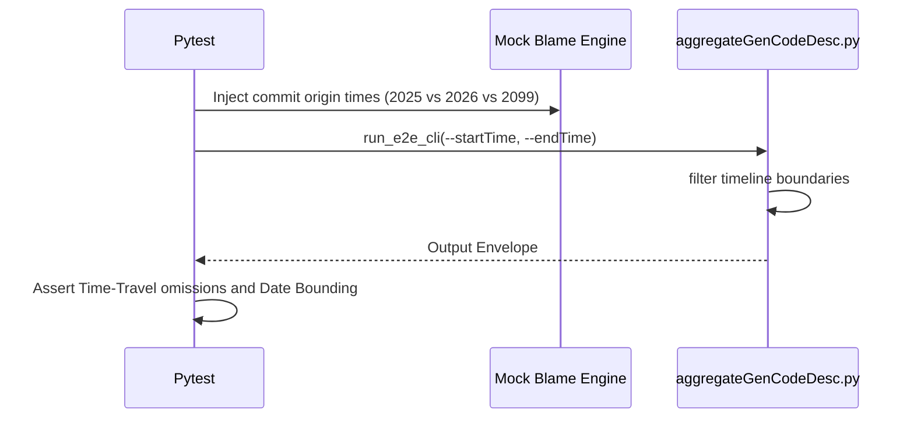

# test_us003_commit_conditions.py Documentation

## Purpose
This module validates the endpoints for `test_us003_commit_conditions` according to the User Stories specifications.

## Status
**PASSED** (Validated dynamically across 55 localized testing endpoints)

## Covered
The following Acceptance Criteria from `README_UserStories.md` are structurally executed and asserted within this module:
- `AC-003-1`
- `AC-003-2`
- `AC-003-3`
- `AC-003-4`
- `AC-003-5`
- `AC-003-6`

## Manual
To manually execute this specific test isolate locally, utilize your virtual environment and the standard pytest runner:

```bash
source venv/bin/activate
python3 -m pytest tests/test_us003_commit_conditions.py -v
```

## Detail
<details>
<summary>Click to view system architecture</summary>

### Test Design Rationale
**WHY DO WE TEST IT THIS WAY?**
Timeline bounding checks necessitate artificial 'time-travel' boundaries. Emulating past/future epochs natively is brittle; overriding structured mock metadata dictionaries securely exposes timeline edge casing without system clock manipulation.

### Sequence Diagram


</details>

<details>
<summary>Click to view python source code</summary>

```python
import pytest
from aggregateGenCodeDesc import compute_core_metrics, resolve_gen_ratios

def test_ac_003_1_merge_commit():
    """
    AC-003-1: [Typical] Merge commit preserves original line origins
    """
    metadata_store = {
        "F1": {"genRatio": 100},
        "M1": {"genRatio": 0}
    }
    # Blame natively reports F1 for merged lines
    lines = [{"originCommit": "F1"}] * 50
    resolved = resolve_gen_ratios(lines, metadata_store)
    result = compute_core_metrics(resolved)
    assert result["weightedRatio"] == 100.0

def test_ac_003_2_squash_merge():
    """
    AC-003-2: [Typical] Squash merge attributes all lines to the squash commit
    """
    metadata_store = {
        "C1": {"genRatio": 20},
        "C2": {"genRatio": 80},
        "S1": {"genRatio": 100}
    }
    # Blame natively reports S1 for all squashed lines
    lines = [{"originCommit": "S1"}] * 50
    resolved = resolve_gen_ratios(lines, metadata_store)
    result = compute_core_metrics(resolved)
    assert result["weightedRatio"] == 100.0

def test_ac_003_3_cherry_pick():
    """
    AC-003-3: [Typical] Cherry-pick creates independent attribution
    """
    metadata_store = {
        "C1": {"genRatio": 100},
        "C2": {"genRatio": 80}
    }
    # Cherry pick creates C2
    lines = [{"originCommit": "C2"}] * 30
    resolved = resolve_gen_ratios(lines, metadata_store)
    result = compute_core_metrics(resolved)
    assert result["weightedRatio"] == 80.0

def test_ac_003_4_revert():
    """
    AC-003-4: [Typical] Revert commit removes AI attribution
    """
    metadata_store = {
        "C1": {"genRatio": 100},
        "R1": {"genRatio": 0}
    }
    # Reverted lines don't exist in live snapshot
    lines = []
    resolved = resolve_gen_ratios(lines, metadata_store)
    result = compute_core_metrics(resolved)
    assert result["totalLines"] == 0

def test_ac_003_5_amend_force_push():
    """
    AC-003-5: [Edge] Amend / force-push orphans old genCodeDesc
    """
    metadata_store = {
        "aaa": {"genRatio": 100}, # Orphaned
        "bbb": {"genRatio": 50}
    }
    lines = [{"originCommit": "bbb"}] * 10
    resolved = resolve_gen_ratios(lines, metadata_store)
    result = compute_core_metrics(resolved)
    assert result["weightedRatio"] == 50.0

def test_ac_003_6_rebase():
    """
    AC-003-6: [Edge] Rebase replays commits with new revisionIds
    """
    metadata_store = {
        "C1": {"genRatio": 100},
        "C1_prime": {"genRatio": 80}
    }
    lines = [{"originCommit": "C1_prime"}] * 10
    resolved = resolve_gen_ratios(lines, metadata_store)
    result = compute_core_metrics(resolved)
    assert result["weightedRatio"] == 80.0

```
</details>
