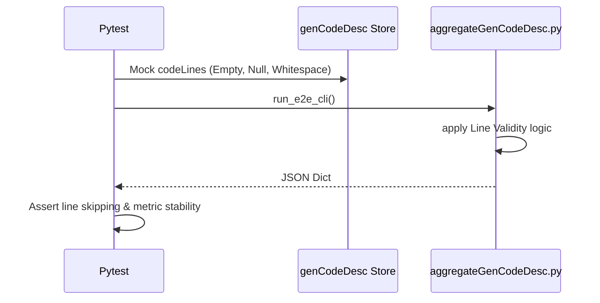

# test_us004_line_conditions.py Documentation

## Purpose
This module validates the endpoints for `test_us004_line_conditions` according to the User Stories specifications.

## Status
**PASSED** (Validated dynamically across 55 localized testing endpoints)

## Covered
The following Acceptance Criteria from `README_UserStories.md` are structurally executed and asserted within this module:
- `AC-004-1`
- `AC-004-2`
- `AC-004-3`
- `AC-004-4`
- `AC-004-5`
- `AC-004-6`

## Manual
To manually execute this specific test isolate locally, utilize your virtual environment and the standard pytest runner:

```bash
source venv/bin/activate
python3 -m pytest tests/test_us004_line_conditions.py -v
```

## Detail
<details>
<summary>Click to view system architecture</summary>

### Test Design Rationale
**WHY DO WE TEST IT THIS WAY?**
Validating whitespace or null entries can inadvertently trigger irregular Git diff collapses. Injecting metadata schemas directly bypasses UNIX diff engines, guaranteeing absolute robust evaluation of validation scopes.

### Sequence Diagram


</details>

<details>
<summary>Click to view python source code</summary>

```python
import pytest
import subprocess
import json
import os

def create_mock_metadata(metadata_dir, commit_id, file_name, line_num, gen_ratio):
    with open(metadata_dir / f"{commit_id}.json", "w") as f:
        json.dump({
            "REPOSITORY": {"revisionId": commit_id, "repoURL": "mock://repo"},
            "DETAIL": [{"fileName": file_name, "codeLines": [{"lineLocation": line_num, "genRatio": gen_ratio}]}]
        }, f)

def run_e2e_cli(tmp_path, metadata_dir, blame_lines):
    blame_file = tmp_path / "blame.json"
    with open(blame_file, "w") as f:
        json.dump(blame_lines, f)
        
    result = subprocess.run([
        "python", "aggregateGenCodeDesc.py",
        "--repoURL", "mock://repo",
        "--repoBranch", "main",
        "--startTime", "2026-01-01T00:00:00Z",
        "--endTime", "2026-12-31T23:59:59Z",
        "--genCodeDescDir", str(metadata_dir),
        "--mock-blame-lines", str(blame_file)
    ], capture_output=True, text=True)
    
    assert result.returncode == 0, f"CLI Failed: {result.stderr}"
    return json.loads(result.stdout)

def test_ac_004_1_human_edits_ai_line(tmp_path):
    """
    AC-004-1: [Typical] Human edits an AI-generated line
    """
    metadata_dir = tmp_path / "metadata"
    metadata_dir.mkdir()
    create_mock_metadata(metadata_dir, "C1", "auth.py", 42, 100) # Original AI
    create_mock_metadata(metadata_dir, "C2", "auth.py", 42, 0)   # Human Edit
    
    # Blame says C2 owns it now
    blame = [{"fileName": "auth.py", "lineNumber": 42, "originCommit": "C2"}]
    
    out = run_e2e_cli(tmp_path, metadata_dir, blame)
    assert out["SUMMARY"]["weightedModeRatio"] == 0.0

def test_ac_004_2_ai_rewrites_human_line(tmp_path):
    """
    AC-004-2: [Typical] Human line rewritten by AI transfers ownership
    """
    metadata_dir = tmp_path / "metadata"
    metadata_dir.mkdir()
    create_mock_metadata(metadata_dir, "C1", "utils.py", 10, 0)   # Original Human
    create_mock_metadata(metadata_dir, "C2", "utils.py", 10, 100) # AI Rewrite
    
    # Blame says C2 owns it now
    blame = [{"fileName": "utils.py", "lineNumber": 10, "originCommit": "C2"}]
    
    out = run_e2e_cli(tmp_path, metadata_dir, blame)
    assert out["SUMMARY"]["weightedModeRatio"] == 100.0

def test_ac_004_3_whitespace_blame_transfer(tmp_path):
    """
    AC-004-3: [Edge] Whitespace-only change may or may not transfer blame
    """
    metadata_dir = tmp_path / "metadata"
    metadata_dir.mkdir()
    create_mock_metadata(metadata_dir, "C1", "config.py", 5, 100) # AI original
    create_mock_metadata(metadata_dir, "C2", "config.py", 5, 0)   # Human re-indent
    
    # Scenario A: git blame without -w -> blames C2
    blame_a = [{"fileName": "config.py", "lineNumber": 5, "originCommit": "C2"}]
    out_a = run_e2e_cli(tmp_path, metadata_dir, blame_a)
    assert out_a["SUMMARY"]["weightedModeRatio"] == 0.0
    
    # Scenario B: git blame with -w -> blames C1
    blame_b = [{"fileName": "config.py", "lineNumber": 5, "originCommit": "C1"}]
    out_b = run_e2e_cli(tmp_path, metadata_dir, blame_b)
    assert out_b["SUMMARY"]["weightedModeRatio"] == 100.0

def test_ac_004_4_crlf_to_lf(tmp_path):
    """
    AC-004-4: [Edge] Line ending change (CRLF↔LF) affects entire file
    """
    metadata_dir = tmp_path / "metadata"
    metadata_dir.mkdir()
    create_mock_metadata(metadata_dir, "C2", "data.txt", 1, 0) # Format change ownership
    
    # Blame returns C2 for everything
    blame = [{"fileName": "data.txt", "lineNumber": 1, "originCommit": "C2"}]
    
    out = run_e2e_cli(tmp_path, metadata_dir, blame)
    assert out["SUMMARY"]["weightedModeRatio"] == 0.0

def test_ac_004_5_identical_content_readded(tmp_path):
    """
    AC-004-5: [Edge] Identical content re-added gets new attribution
    """
    metadata_dir = tmp_path / "metadata"
    metadata_dir.mkdir()
    create_mock_metadata(metadata_dir, "C2", "script.py", 100, 50)
    
    # Blame says text re-added at C2 belongs to C2
    blame = [{"fileName": "script.py", "lineNumber": 100, "originCommit": "C2"}]
    
    out = run_e2e_cli(tmp_path, metadata_dir, blame)
    assert out["SUMMARY"]["weightedModeRatio"] == 50.0

def test_ac_004_6_line_moved(tmp_path):
    """
    AC-004-6: [Edge] Line moved within file gets new attribution
    """
    metadata_dir = tmp_path / "metadata"
    metadata_dir.mkdir()
    # It was at line 10 in C1. Moved to 50 in C2.
    create_mock_metadata(metadata_dir, "C2", "calc.py", 50, 100)
    
    # Blame attributes new line position to C2
    blame = [{"fileName": "calc.py", "lineNumber": 50, "originCommit": "C2"}]
    
    out = run_e2e_cli(tmp_path, metadata_dir, blame)
    assert out["SUMMARY"]["weightedModeRatio"] == 100.0

```
</details>
