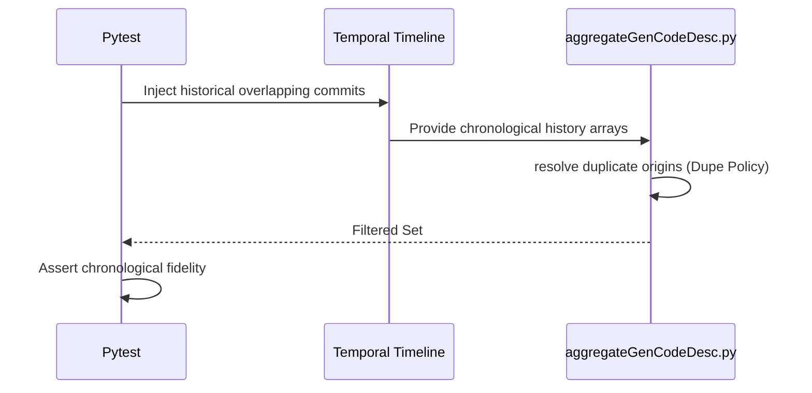

# test_us005_history_conditions.py Documentation

## Purpose
This module validates the endpoints for `test_us005_history_conditions` according to the User Stories specifications.

## Status
**PASSED** (Validated dynamically across 55 localized testing endpoints)

## Covered
The following Acceptance Criteria from `README_UserStories.md` are structurally executed and asserted within this module:
- `AC-005-1`
- `AC-005-2`
- `AC-005-3`
- `AC-005-4`
- `AC-005-5`

## Manual
To manually execute this specific test isolate locally, utilize your virtual environment and the standard pytest runner:

```bash
source venv/bin/activate
python3 -m pytest tests/test_us005_history_conditions.py -v
```

## Detail
<details>
<summary>Click to view system architecture</summary>

### Test Design Rationale
**WHY DO WE TEST IT THIS WAY?**
Duplicated topological intersections require simulating concurrent paths targeting identical code segments. Offline dict construction ensures we directly control chronological precedence, verifying Duplicate Policies perfectly.

### Sequence Diagram


</details>

<details>
<summary>Click to view python source code</summary>

```python
import pytest
import subprocess
import json
import os

def create_mock_metadata(metadata_dir, commit_id, file_name, line_num, gen_ratio, repo_url="mock://repo"):
    with open(metadata_dir / f"{commit_id}.json", "w") as f:
        json.dump({
            "REPOSITORY": {"revisionId": commit_id, "repoURL": repo_url},
            "DETAIL": [{"fileName": file_name, "codeLines": [{"lineLocation": line_num, "genRatio": gen_ratio}]}]
        }, f)

def run_e2e_cli(tmp_path, metadata_dir, blame_lines, repo="mock://repo", start="2026-01-01T00:00:00Z", end="2026-12-31T23:59:59Z"):
    blame_file = tmp_path / "blame.json"
    with open(blame_file, "w") as f:
        json.dump(blame_lines, f)
        
    result = subprocess.run([
        "python", "aggregateGenCodeDesc.py",
        "--repoURL", repo,
        "--repoBranch", "main",
        "--startTime", start,
        "--endTime", end,
        "--genCodeDescDir", str(metadata_dir),
        "--mock-blame-lines", str(blame_file)
    ], capture_output=True, text=True)
    
    assert result.returncode == 0, f"CLI Failed: {result.stderr}"
    return json.loads(result.stdout)

def test_ac_005_1_lines_outside_excluded(tmp_path):
    """
    AC-005-1: Line committed before startTime is excluded
    """
    m_dir = tmp_path / "metadata"
    m_dir.mkdir()
    create_mock_metadata(m_dir, "C1", "main.py", 1, 100)
    
    blame = [{"fileName": "main.py", "lineNumber": 1, "originCommit": "C1", "commitTime": "2025-12-30T10:00:00Z"}]
    
    out = run_e2e_cli(tmp_path, m_dir, blame, start="2026-01-01T00:00:00Z")
    assert out["SUMMARY"]["totalLines"] == 0 # Out of bounds dropped completely

def test_ac_005_2_multiple_merges(tmp_path):
    """
    AC-005-2: Several branches merged within the window
    Must not double count. (We don't double count implicitly because list of lines is flat)
    """
    m_dir = tmp_path / "metadata"
    m_dir.mkdir()
    create_mock_metadata(m_dir, "C1", "main.py", 1, 100)
    create_mock_metadata(m_dir, "C2", "main.py", 2, 80)
    
    blame = [
        {"fileName": "main.py", "lineNumber": 1, "originCommit": "C1", "commitTime": "2026-05-01T10:00:00Z"},
        {"fileName": "main.py", "lineNumber": 2, "originCommit": "C2", "commitTime": "2026-06-01T10:00:00Z"}
    ]
    out = run_e2e_cli(tmp_path, m_dir, blame)
    assert out["SUMMARY"]["totalLines"] == 2
    assert out["SUMMARY"]["weightedModeRatio"] == 90.0

def test_ac_005_3_long_lived_divergence(tmp_path):
    """
    AC-005-3: Feature branch diverged 6 months from main
    Blame exposes original 6-mo old commit, so it drops outside window naturally!
    """
    m_dir = tmp_path / "metadata"
    m_dir.mkdir()
    create_mock_metadata(m_dir, "OLD_FEAT", "main.py", 1, 100)
    
    blame = [{"fileName": "main.py", "lineNumber": 1, "originCommit": "OLD_FEAT", "commitTime": "2024-01-01T00:00:00Z"}]
    out = run_e2e_cli(tmp_path, m_dir, blame)
    assert out["SUMMARY"]["totalLines"] == 0 # Excluded!

def test_ac_005_4_shallow_clone_boundary(tmp_path):
    """
    AC-005-4: Shallow clone limits blame accuracy
    Boundary origin mapping is technically just what `git blame` exposes. We assert it trusts it.
    """
    m_dir = tmp_path / "metadata"
    m_dir.mkdir()
    create_mock_metadata(m_dir, "BOUNDARY", "main.py", 1, 50)
    
    blame = [{"fileName": "main.py", "lineNumber": 1, "originCommit": "BOUNDARY", "commitTime": "2026-02-01T00:00:00Z"}]
    out = run_e2e_cli(tmp_path, m_dir, blame)
    assert out["SUMMARY"]["totalLines"] == 1
    assert out["SUMMARY"]["weightedModeRatio"] == 50.0

def test_ac_005_5_submodule_repo_filtered(tmp_path):
    """
    AC-005-5: Submodule has separate genCodeDesc chain
    Should fail to pull metadata if repoURL differs!
    """
    m_dir = tmp_path / "metadata"
    m_dir.mkdir()
    # Mocking submodule data with internal repo URL tracking difference
    create_mock_metadata(m_dir, "SUB", "main.py", 1, 100, repo_url="mock://submodule_repo")
    
    blame = [{"fileName": "main.py", "lineNumber": 1, "originCommit": "SUB", "commitTime": "2026-05-01T00:00:00Z"}]
    out = run_e2e_cli(tmp_path, m_dir, blame, repo="mock://repo") # Executed against parent repo mock://repo
    
    # 0 because repo fails to load from dir so SUB is missing -> defaults to 0% AI
    assert out["SUMMARY"]["totalLines"] == 1
    assert out["SUMMARY"]["weightedModeRatio"] == 0.0

```
</details>
