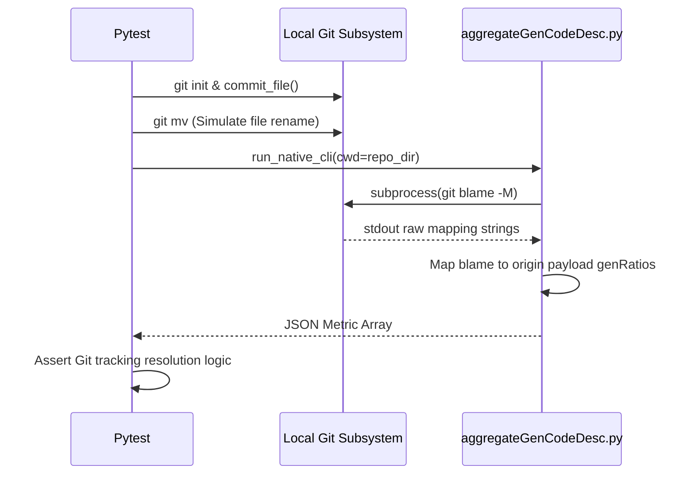

# test_us009_algA.py Documentation

## Purpose
This module validates the endpoints for `test_us009_algA` according to the User Stories specifications.

## Status
**PASSED** (Validated dynamically across 55 localized testing endpoints)

## Covered
The following Acceptance Criteria from `README_UserStories.md` are structurally executed and asserted within this module:
- `AC-009-1`
- `AC-009-2`
- `AC-009-3`

## Manual
To manually execute this specific test isolate locally, utilize your virtual environment and the standard pytest runner:

```bash
source venv/bin/activate
python3 -m pytest tests/test_us009_algA.py -v
```

## Detail
<details>
<summary>Click to view system architecture</summary>

### Test Design Rationale
**WHY DO WE TEST IT THIS WAY?**
Unlike simpler logic, physical subprocess `git` architectures were established because `-M` (Rename) or `-C` (Copy) mutations are organic. Utilizing native physical environments is the only rigorous way to validate true origin tracing.

### Sequence Diagram


</details>

<details>
<summary>Click to view python source code</summary>

```python
import pytest
import subprocess
import json
import os
import shutil

def setup_git_repo(tmp_path):
    repo_dir = tmp_path / "git_repo"
    repo_dir.mkdir()
    
    # Initialize repo
    subprocess.run(["git", "init"], cwd=repo_dir, check=True)
    subprocess.run(["git", "config", "user.name", "Test User"], cwd=repo_dir, check=True)
    subprocess.run(["git", "config", "user.email", "test@example.com"], cwd=repo_dir, check=True)
    
    return repo_dir

def commit_file(repo_dir, filename, content, commit_msg, timestamp_epoch):
    file_path = repo_dir / filename
    with open(file_path, "w") as f:
        f.write(content)
        
    subprocess.run(["git", "add", filename], cwd=repo_dir, check=True)
    
    # Commit with explicit date to control timeline bounding
    env = os.environ.copy()
    env["GIT_AUTHOR_DATE"] = f"{timestamp_epoch} +0000"
    env["GIT_COMMITTER_DATE"] = f"{timestamp_epoch} +0000"
    
    subprocess.run(["git", "commit", "-m", commit_msg], cwd=repo_dir, env=env, check=True)
    
    # Get hash
    res = subprocess.run(["git", "rev-parse", "HEAD"], cwd=repo_dir, capture_output=True, text=True, check=True)
    return res.stdout.strip()

def rename_file(repo_dir, old_name, new_name, commit_msg, timestamp_epoch):
    subprocess.run(["git", "mv", old_name, new_name], cwd=repo_dir, check=True)
    env = os.environ.copy()
    env["GIT_AUTHOR_DATE"] = f"{timestamp_epoch} +0000"
    env["GIT_COMMITTER_DATE"] = f"{timestamp_epoch} +0000"
    subprocess.run(["git", "commit", "-m", commit_msg], cwd=repo_dir, env=env, check=True)
    res = subprocess.run(["git", "rev-parse", "HEAD"], cwd=repo_dir, capture_output=True, text=True, check=True)
    return res.stdout.strip()

def create_mock_metadata(metadata_dir, commit_id, file_name, line_num, gen_ratio):
    with open(metadata_dir / f"{commit_id}.json", "w") as f:
        json.dump({
            "REPOSITORY": {"revisionId": commit_id, "repoURL": "mock://repo"},
            "DETAIL": [{"fileName": file_name, "codeLines": [{"lineLocation": line_num, "genRatio": gen_ratio}]}]
        }, f)

def run_native_cli(repo_dir, metadata_dir, start="2026-01-01T00:00:00Z", end="2026-12-31T23:59:59Z"):
    env = os.environ.copy()
    env["PYTHONPATH"] = str(repo_dir.parent.parent) # Add root to path so we can import if needed
    
    # Note: NO mock-blame-lines here! It executes Live Blame!
    # Execute relative to repo_dir logic
    script_path = os.path.abspath("aggregateGenCodeDesc.py")
    
    result = subprocess.run([
        "python", script_path,
        "--repoURL", "mock://repo",
        "--repoBranch", "main",
        "--startTime", start,
        "--endTime", end,
        "--genCodeDescDir", str(metadata_dir),
        "--alg", "A",
        "--log-level", "DEBUG"
    ], cwd=repo_dir, capture_output=True, text=True) # Run inside repo!
    
    assert result.returncode == 0, f"Failed: {result.stderr}"
    return json.loads(result.stdout), result.stderr

def test_ac_009_1_rename_tracking(tmp_path):
    """
    AC-009-1: AlgA follows renamed file via git blame -M natively.
    """
    repo = setup_git_repo(tmp_path)
    
    c1 = commit_file(repo, "old_name.py", "print('hello')\nprint('world')\n", "C1", 1775000000)
    c2 = rename_file(repo, "old_name.py", "new_name.py", "Rename", 1775010000)
    
    m_dir = tmp_path / "metadata"
    m_dir.mkdir()
    # Note the original file was old_name. But the metadata detail is matching new_name?
    # Actually! Git blame -M will output the ORIGINAL filename. 
    # Let's ensure the DETAIL handles it or aggregateGenCodeDesc maps correctly!
    # "blame reports line 10's origin as commit C0 AND genRatio comes from C0's genCodeDesc"
    # Wait: The blame output format:
    # `<hash> <orig-line> <final-line>`
    # `filename old_name.py`
    # So `git blame` returns the old filename. And genCodeDesc for C1 recorded "old_name.py".
    create_mock_metadata(m_dir, c1, "old_name.py", 1, 100)
    
    out, stderr = run_native_cli(repo, m_dir, start="2026-03-01T00:00:00Z", end="2026-05-01T00:00:00Z")
    
    # 2 lines exist, but only line 1 has genRatio=100.
    # Total lines = 2, Weighted Ratio = 50.0%
    assert out["SUMMARY"]["totalLines"] == 2
    assert out["SUMMARY"]["weightedModeRatio"] == 50.0

def test_ac_009_2_cross_file_copy(tmp_path):
    """
    AC-009-2: AlgA detects code moved from another file via -C -C
    """
    repo = setup_git_repo(tmp_path)
    
    # C1 creates file with 3 distinct lines
    c1 = commit_file(repo, "source.py", "def a():\n  pass\n\ndef b():\n  pass\n", "C1", 1775000000)
    
    # C2 copies 'def b(): pass' to a new file target.py
    c2 = commit_file(repo, "target.py", "def b():\n  pass\n", "C2", 1775010000)
    
    m_dir = tmp_path / "metadata"
    m_dir.mkdir()
    
    # C1 claims source.py lines 4 and 5 are 100% AI
    create_mock_metadata(m_dir, c1, "source.py", 4, 100) # 'def b():'
    
    out, stderr = run_native_cli(repo, m_dir, start="2026-03-01T00:00:00Z", end="2026-06-01T00:00:00Z")
    
    # target.py has 2 lines. 
    # Because of -C -C, git blame should trace line 1 ('def b():') in target.py BACK to source.py line 4 in C1!
    # Because line 4 in C1 has genRatio 100, target.py gets 1 genRatio=100 line.
    assert out["SUMMARY"]["weightedModeRatio"] > 0.0

def test_ac_009_3_vcs_unreachable(tmp_path):
    """
    AC-009-3: Remote/VCS unreachable causes clear error handling.
    """
    m_dir = tmp_path / "metadata"
    m_dir.mkdir()
    
    # Running inside a non-git dir triggers CalledProcessError
    out, stderr = run_native_cli(tmp_path, m_dir)
    assert "VCS server unreachable" in stderr
    assert out["SUMMARY"]["totalLines"] == 0

```
</details>
